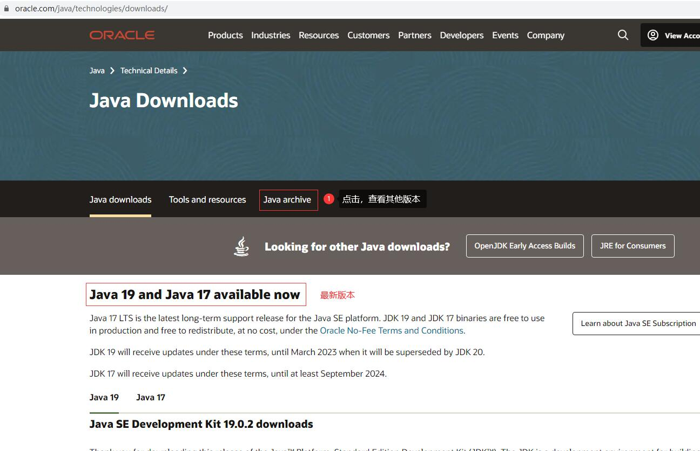
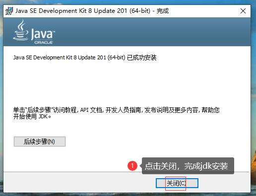

# 一、SpringBoot入门

### 1. 环境搭建

#### 1.1 JDK安装配置

##### 1. JDK下载

下载地址：https://www.oracle.com/

下载地址：https://www.oracle.com/java/technologies/javase/javase8-archive-downloads.html

安装完毕。

##### 2. JDK安装

双击jdk-8u201-windows-x64.exe

##### 3. JDK配置

1.右键单击桌面上的此电脑，选择属性--》高级系统设置--》高级--》环境变量...--》在系统变量点选新建...

2.变量名输入：JAVA_HOME,变量值可以通过点选浏览目录找到jdk安装的路径，也可以自行输入jdk的目录路径（根据自己安装jdk的路径输入）

3.点选新建，在变量名输入：CLASSPATH,变量值为：.;%JAVA_HOME%\lib\dt.jar;%JAVA_HOME%\lib\tools.jar;

注意前面的小点和后面的分号也是值的一部分。

4.找到path变量，点击编辑，点击新建，输入变量：%JAVA_HOME%\bin,再上移到顶部，点击确定

4.配置完成后的结果如下

##### 4.JDK验证

1.使用Windows图标+R，快速打开“运行”操作界面，并输入cmd，回车确认。出现命令提示符窗口

2.在命令提示符窗口，输入：java -version查看JDK版本号，输入：javac查看命令选项

#### 1.2 MAVEN安装配置

##### 1. MAVEN下载

下载Maven包可以直接去Maven官网：https://maven.apache.org/

其他版本下载

以下载3.8.7为例,点击3.8.7

点击binaries

点击apache-maven-3.8.7-bin.zip

将apache-maven-3.8.7-bin.zip解压到c盘(具体目录可以自行根据情况定义)

##### 2. MAVEN配置

我的电脑/此电脑 --》右键属性 --》高级系统设置 --》环境变量 --》系统变量 --》新建 --》确定/保存

- 变量名是MAVEN_HOME
- 变量值是Maven的安装路径

我的电脑/此电脑 --》右键属性 --》高级系统设置 --》环境变量 --》系统变量 --》新建 --》确定/保存

- 变量名是MAVEN_HOME
- 变量值是Maven的安装路径

##### 3. MAVEN验证

使用Windows图标+R，快速打开“运行”操作界面，并输入cmd，回车确认。出现命令提示符窗口

##### 4. 配置本地仓库

在C:\apache-maven-3.8.7路径下，新建maven-repository文件夹，用作maven的本地库

在路径C:\apache-maven-3.8.7\conf下找到settings.xml文件，双击编辑该文件

在settings.xml文件，找到节点localRepository，在注释外添加C:\apache-maven-3.8.7\maven-repository

~~~XML
<!--  localRepository配置maven本地仓库，根据情况设置   -->
<localRepository>C:\apache-maven-3.8.7\maven-repository</localRepository>
~~~

##### 5. 配置镜像

- 在settings.xml配置文件中找到mirrors节点

- 添加如下配置（注意要添加在和两个标签之间，其它配置同理）

~~~XML
<!-- 阿里云仓库 -->
<mirror>
  <id>alimaven</id>
  <mirrorOf>central</mirrorOf>
  <name>aliyun maven</name>
  <url>http://maven.aliyun.com/nexus/content/repositories/central/</url>
</mirror>
~~~

##### 6. 配置JDK

- 1.在settings.xml配置文件中找到profiles节点

- 2.添加如下配置(根据自己安装Java的版本)

~~~XML
<!-- java版本 --> 
<profile>
  <id>jdk-1.8</id>
  <activation>
    <activeByDefault>true</activeByDefault>
    <jdk>1.8</jdk>
  </activation>

  <properties>
    <maven.compiler.source>1.8</maven.compiler.source>
    <maven.compiler.target>1.8</maven.compiler.target>
    <maven.compiler.compilerVersion>1.8</maven.compiler.compilerVersion>
  </properties>
</profile>
~~~

##### 7. 验证

使用Windows图标+R，快速打开“运行”操作界面，并输入cmd，回车确认。出现命令提示符窗口

在命令提示符窗口输入：mvn help:system,结果如下

#### 1.3 SpringBoot项目创建

